# [Lesson 1] Introduction to Prompt Engineering

## The 5-Minute Gist 

Prompt engineering is the art and science of crafting effective instructions for AI language models. Think of it as learning to communicate with a highly capable assistant who takes your words literally—the clearer and more structured your request, the better the response. In this lesson, we'll explore the fundamentals of prompt engineering and put theory into practice using n8n, a powerful workflow automation tool.

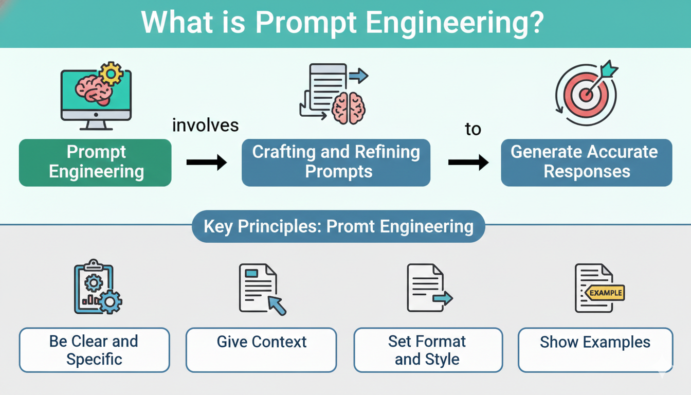

---

## What is Prompt Engineering?

Prompt engineering is the practice of designing and refining input prompts to effectively communicate with AI language models. It involves crafting clear, specific instructions that guide the AI to produce the desired output.

Just as a well-briefed employee performs better than one given vague instructions, an AI model produces significantly better results when given well-structured prompts. The difference between a mediocre output and an excellent one often lies not in the model's capabilities, but in how effectively you communicate your requirements.


---

## Key Principles of Prompt Engineering

Understanding these fundamental principles will help you create more effective prompts:

| Principle | Description |
|-----------|-------------|
| **Be Clear and Specific** | Provide precise instructions about what you want |
| **Provide Context** | Give the AI relevant background information |
| **Use Examples** | Show the AI the format or style you expect |
| **Set Constraints** | Define boundaries, length, or format requirements |
| **Iterate and Refine** | Test and improve your prompts based on results |

💡 **Pro Tip:** The more specific your prompt, the less room for interpretation—and the more predictable your results.

---

## Methods Used in Prompts

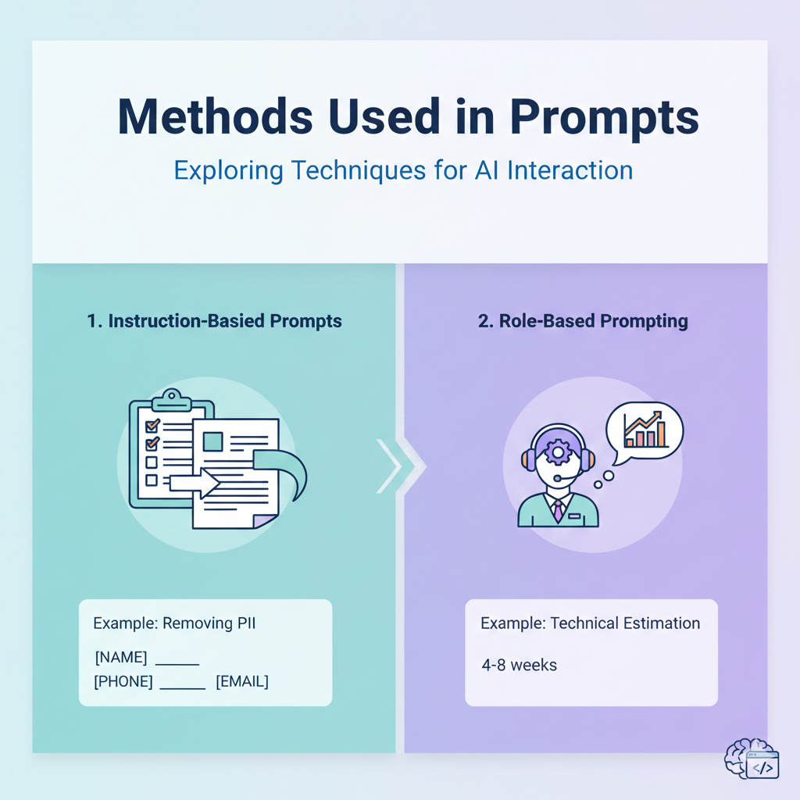

There are different types of prompts that you can use to interact with AI models based on your specific task requirements. Let's explore the two most common approaches:

### 1. Instruction-Based Prompts

In this approach, you provide explicit instructions to the AI model, clearly stating what task needs to be performed. The model follows these instructions to generate the desired output.

**Example: Removing Personally Identifiable Information (PII)**

**INPUT:**
```
Read the following sales email. Remove any personally identifiable information (PII),
and replace it with the appropriate placeholder. For example, replace the name
"Sachin Parmar" with "[NAME]".

Hi John,

I'm writing to you because I noticed you recently purchased a new car. I'm a
salesperson at a local dealership (Cheap Dealz), and I wanted to let you know
that we have a great deal on a new car. If you're interested, please let me know.

Thanks,
Sachin Parmar
Phone: 410-805-2345
Email: ABC@gmail.com
```

**OUTPUT:**
```
Hi [NAME],

I'm writing to you because I noticed you recently purchased a new car. I'm a
salesperson at a local dealership, and I wanted to let you know that we have a
great deal on a new car. If you're interested, please let me know.

Thanks,
[SALESPERSON]
Phone: [PHONE]
Email: [EMAIL]
```

---

### 2. Role-Based Prompting

This technique involves assigning a specific role or persona to the AI model before asking questions. This helps the model respond from a particular perspective or domain expertise.

**Example: Technical Estimation**

**INPUT:**
```
You are a frontend engineer. Now estimate what it takes to build a stunning
website for a startup with 10 pages, with very basic interactions and simple
functionality. Just give the estimate in weeks, restrict your answer to 2 lines.
```

**OUTPUT:**
```
A stunning website for a startup with 10 pages, basic interactions, and simple
functionality could take approximately 4-8 weeks to complete. However, the actual
time required may vary depending on project-specific requirements and available
resources.
```

---

## Bad, Good, and Better Prompts: Guide

The difference between an unhelpful AI response and a game-changing insight often comes down to how you frame your prompt. Let's look at real Product Manager scenarios and see how prompts evolve from ineffective to highly effective.

### Example 1: Writing a PRD

❌ **Bad Prompt:**
```
Write a PRD for a new feature.
```
*Why it fails: No context about the product, feature, users, or goals. The AI has nothing to work with.*

✅ **Good Prompt:**
```
Write a PRD for a notification system for our project management app.
Include problem statement, proposed solution, and success metrics.
```
*Why it's better: Specifies the feature, product context, and required sections.*

🚀 **Better Prompt:**
```
You are a Senior PM at a B2B SaaS company. Write a PRD for an in-app notification
system for our project management tool used by remote teams (10-50 employees).

Context: Users currently miss important updates because they rely on email,
leading to a 23% drop in task completion rates.

Include:
- Problem statement with user pain points
- Proposed solution with key features
- User stories for 3 personas (Admin, Team Lead, Team Member)
- Success metrics tied to business goals
- Out of scope items
- Open questions for engineering

Format: Use headers, bullet points, and tables where appropriate.
```
*Why it's best: Role assignment, specific context with data, clear structure, defined personas, and explicit formatting.*

---

### Example 2: Competitive Analysis

❌ **Bad Prompt:**
```
Analyze our competitors.
```
*Why it fails: No product context, no specific competitors, no analysis framework.*

✅ **Good Prompt:**
```
Compare Notion, Asana, and Monday.com as project management tools.
List their strengths and weaknesses.
```
*Why it's better: Names specific competitors and asks for structured comparison.*

🚀 **Better Prompt:**
```
I'm a PM at a startup building a project management tool for creative agencies (50-200 employees).

Analyze these competitors: Notion, Asana, Monday.com, and ClickUp.

For each competitor, provide:
| Aspect | Details |
|--------|---------|
| Target Audience | Who they primarily serve |
| Core Value Proposition | Their main differentiator |
| Pricing Strategy | Free tier, per-seat, enterprise |
| Key Strengths | Top 3 features users love |
| Key Weaknesses | Top 3 user complaints (from G2/Capterra) |
| Gap Opportunity | What they're missing that we could exploit |

End with: 3 actionable recommendations for how we can differentiate in this market.
```
*Why it's best: Defines our context, specifies output format, asks for actionable insights, and references real data sources.*

---

### Key Takeaways

| Level | Characteristics |
|-------|-----------------|
| ❌ **Bad** | Vague, no context, no structure, leaves everything to interpretation |
| ✅ **Good** | Specific topic, some context, basic structure requested |
| 🚀 **Better** | Role/persona, rich context with data, clear format, actionable output, edge cases considered |

💡 **Remember:** The time you invest in crafting a better prompt pays off exponentially in the quality and usefulness of the AI's response.

---

## Anatomy of a Perfect Prompt

A well-structured prompt contains four essential components: **Role**, **Instruction**, **Task**, and **Guardrails**. Here are two PM-focused examples that demonstrate this structure:

---

### Example 1: Market Research Analysis

```
[ROLE]
You are a Senior Market Research Analyst with 10 years of experience in the
B2B SaaS industry, specializing in competitive intelligence and market sizing.

[INSTRUCTION]
Conduct a comprehensive market research analysis for a new product launch.
Use data-driven insights, cite industry trends, and structure your findings
in a format suitable for executive presentation.

[TASK]
Analyze the project management software market for our new AI-powered task
automation tool targeting mid-size companies (100-500 employees).

Deliver:
1. Market size and growth rate (TAM, SAM, SOM)
2. Top 5 competitors with their market share and positioning
3. Key market trends driving adoption
4. Target customer segments with pain points
5. Recommended go-to-market positioning

[GUARDRAILS]
- Focus only on the North American market
- Do not include enterprise segment (500+ employees)
- Avoid speculation—clearly label assumptions vs. data-backed insights
- Keep the analysis under 1000 words
- Do not recommend pricing strategies (that's a separate analysis)
```

---

### Example 2: Sprint Planning User Stories

```
[ROLE]
You are a Product Manager at a fintech startup, experienced in agile
methodologies and writing clear, developer-ready user stories.

[INSTRUCTION]
Write user stories for our upcoming sprint focused on improving the
onboarding experience. Each story should be independent, testable,
and sized for completion within a single sprint (2 weeks).

[TASK]
Create 5 user stories for the "Quick Account Setup" feature that allows
new users to open a savings account in under 3 minutes.

For each user story provide:
- Title
- User story (As a... I want... So that...)
- Acceptance criteria (Given/When/Then format)
- Definition of done
- Story points estimate (1, 2, 3, 5, or 8)

[GUARDRAILS]
- Do not include KYC verification (handled by separate team)
- Stories must comply with banking regulations—flag any compliance considerations
- Avoid technical implementation details—focus on user outcomes
- Do not combine multiple features into a single story
- Each story must be achievable without dependencies on other stories in this set
```

---

### The Four Components Explained

| Component | Purpose | Key Questions to Ask |
|-----------|---------|---------------------|
| **Role** | Defines the AI's persona and expertise level | Who should the AI "be"? What expertise is needed? |
| **Instruction** | Sets the approach, methodology, and quality expectations | How should the AI approach this? What standards apply? |
| **Task** | Specifies exactly what needs to be delivered | What are the concrete outputs? What format? |
| **Guardrails** | Prevents unwanted outputs and keeps focus | What should be excluded? What are the boundaries? |

💡 **Pro Tip:** When your prompts aren't giving good results, check which of these four components is missing or weak. Usually, it's the guardrails that are overlooked.

---

## Understanding n8n

Now that we've covered prompt engineering fundamentals, let's explore the tool we'll use for our hands-on lab.

### What is n8n?

n8n (pronounced "n-eight-n") is a powerful, open-source workflow automation tool that allows you to connect various apps and services to automate tasks without writing code. It provides a visual interface where you can design complex workflows using a node-based system.


*Source: n8n workflow automation platform*

**n8n enables you to:**

- Automate repetitive tasks across multiple applications
- Integrate different services and APIs seamlessly
- Build custom workflows with a visual drag-and-drop interface
- Self-host or use cloud—deploy on your own infrastructure or use n8n Cloud
- Extend functionality with custom nodes and JavaScript code

### Key Features of n8n

| Feature | Description |
|---------|-------------|
| **300+ Integrations** | Connect to popular services like Google Sheets, Slack, GitHub, databases, and more |
| **Visual Workflow Editor** | Intuitive drag-and-drop interface for building automation |
| **Flexible Execution** | Run workflows on schedule, webhook triggers, or manual execution |
| **Data Transformation** | Process and transform data between different services |
| **Error Handling** | Built-in error workflows and retry mechanisms |
| **Open Source** | Free to use and customize according to your needs |

---

## Hands-On Lab: Building an AI Agent in n8n

Let's put our prompt engineering knowledge into practice by building an AI-powered market research agent in n8n.

### Prerequisites

Before starting, ensure you have:
- [ ] Access to n8n dashboard (cloud or self-hosted)
- [ ] OpenAI API key with available credits
- [ ] Downloaded the n8n workflow file from the prerequisites section

---

### Step 1: Access the n8n Dashboard

Once logged into your n8n dashboard, you'll see a screen similar to the image below. Click on **"Start from Scratch"** to create a new workflow.

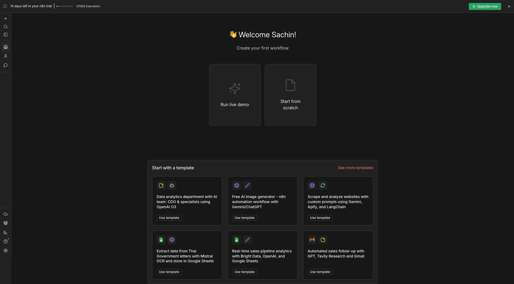

---

### Step 2: Import the Workflow

You'll be redirected to the canvas dashboard (black background).

1. Click on the **three dots** menu in the top-right corner
2. Select **"Import from File"**
3. Choose the workflow file you downloaded from the prerequisites section


Once imported, the pre-built workflow will appear on your canvas.


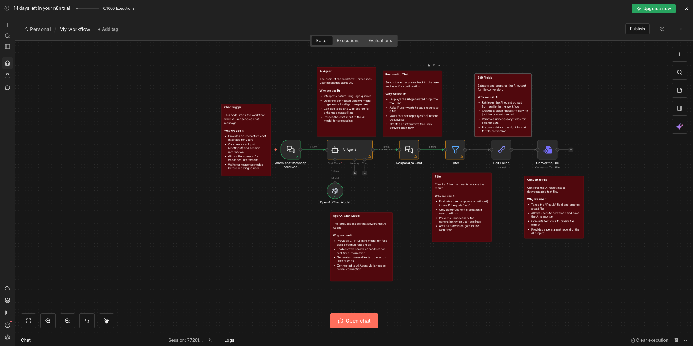


---

### Step 3: Configure the OpenAI Connection

Before running the workflow, we need to set up the AI model connection.

**Sub-step 3.1:** Click on the **OpenAI Chat Model** node

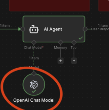

**Sub-step 3.2:** From the dropdown, click **"Create New Credential"**

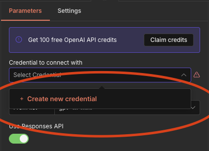

**Sub-step 3.3:** Enter your OpenAI API key

> ⚠️ **Important:** Ensure your OpenAI API key has available credits. The workflow will not function without sufficient credits.

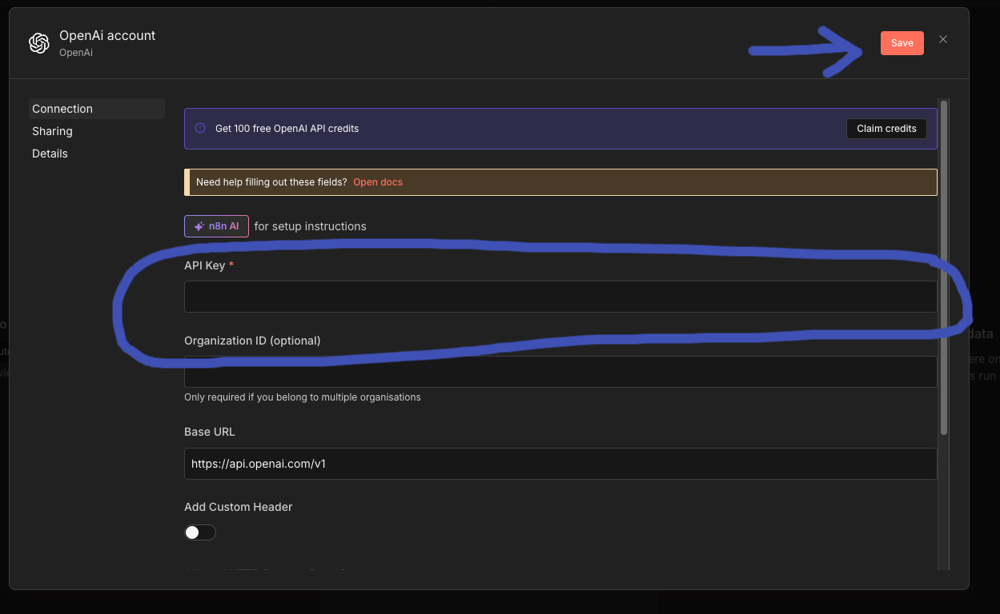

**Sub-step 3.4:** In the OpenAI Chat Model settings, you can enable built-in tools. We've enabled **Web Search** with low context by default—adjust based on your requirements.

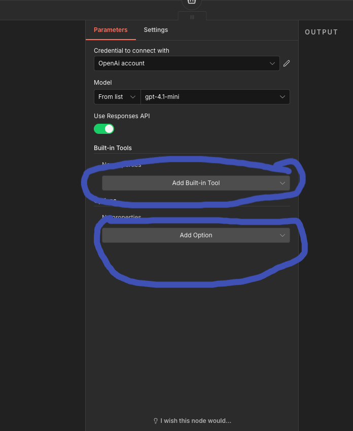

after Adding Web search

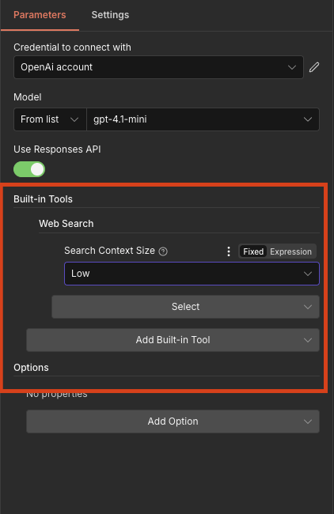

💡 **Note:** Take time to read through all the sticky notes on the canvas to understand what each component does.

---

### Step 4: Understanding the Agent Configuration

Click on the **Agent** node to explore its configuration.

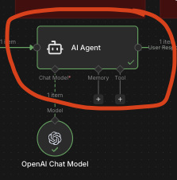

In the **System Message** field, you'll find a prompt that defines how the agent behaves. This prompt includes the four key fundamentals of prompt engineering:

| Component | Purpose |
|-----------|---------|
| **Role** | Defines who the agent is (e.g., "You are a market research analyst") |
| **Instructions** | Specifies what the agent should do |
| **Output Format** | Describes how results should be structured |
| **Guardrails** | Sets boundaries and limitations for the agent |

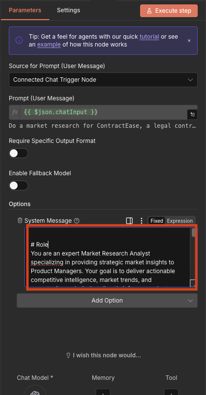

### System Message vs User Message

Understanding the difference between these two message types is crucial:

| Message Type | Description | Example |
|--------------|-------------|---------|
| **System Message** | Pre-configured instructions that define the agent's behavior and persona | "You are a market research analyst. Always provide data-backed insights..." |
| **User Message** | The actual query or request from the user during interaction | "Do market research for ContractEase, a legal contract management product" |

---

### Step 5: Run the Workflow

Once configuration is complete, click the **"Open Chat"** button to start interacting with your agent.


---

### Step 6: Test with a User Query

In the chat interface, enter a user message to test the agent:

```
Do a market research for ContractEase, a legal contract drafting and management product.
```

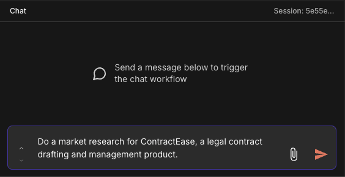

---

### Step 7: Review the Response

The agent will process your query based on the instructions provided in the system message and generate a comprehensive response.

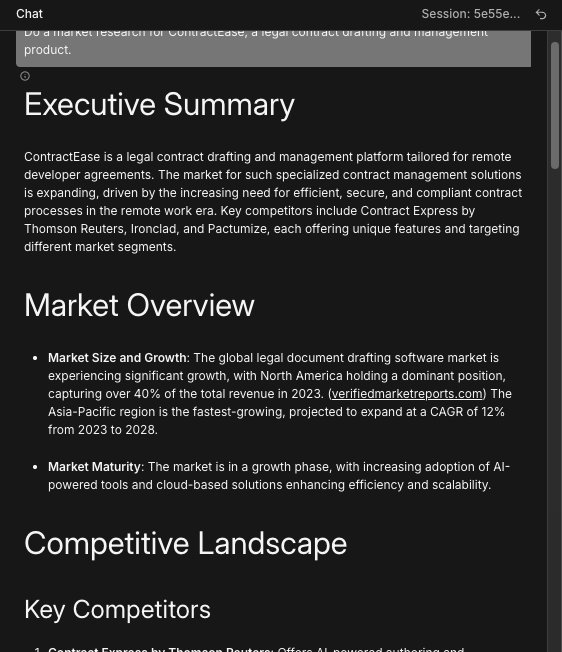

---

### Step 8: Save Your Results

After receiving your response, the workflow will prompt you: **"Would you like to save this to a file?"**

Reply with **"Yes"** or **"No"** based on your preference.


---

### Step 9: Download the Output

If you selected "Yes":
1. Navigate to the **Logs** section
2. Click on **"Convert to File"** option
3. Download the text file for use in your PRD or other documentation

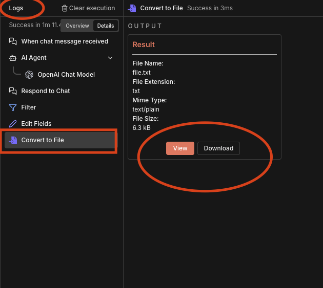

---

### Step 10: Extend Your Learning

You can repurpose this workflow for different research tasks by modifying the system message.

**Try this:** Change the agent to perform **User Research** instead of Market Research by updating the system prompt accordingly.

### 📎 **Resource:** Check out the **[100x Golden Prompts – Click Here](https://docs.google.com/document/d/1B2Y5z06zXl8uoFgPtdABRx5L3wzmEQ3bsaANkmq1oHo/edit?tab=t.d6qva2ddb5pu)** sheet for ready-to-use prompts for market and user research.


---

## Top 10 Best Practices for Prompt Engineering

Using our learnings, let's walk through ten best practices that will elevate your prompt engineering skills—with examples tailored for Product Managers:

### 1. Be Specific with Information Requests

Ask for precise information rather than vague queries.

📌 **Example:**
```
Analyze the user feedback data and extract the top 5 feature requests,
their frequency count, and the user segments requesting them.
```

---

### 2. Supply Examples for Context

Provide format examples to guide the AI's response structure.

📌 **Example:**
```
Write user stories in this format: "As a [user type], I want [goal] so that [benefit]."
Example: "As a free-tier user, I want to export reports so that I can share insights with my team."
```

---

### 3. Include Relevant Data

Reference specific sections or parts of the document for focused analysis.

📌 **Example:**
```
Based on the Q3 NPS survey results attached, identify the top 3 pain points
mentioned by churned users in the Enterprise segment.
```

---

### 4. Specify Desired Output Format

Define exactly how you want the information presented.

📌 **Example:**
```
Create a feature prioritization matrix with columns: "Feature Name", "Impact (1-5)",
"Effort (1-5)", "RICE Score", and "Recommended Priority".
```

---

### 5. Use Positive Instructions

Frame requests positively, stating what to do rather than what not to do.

📌 **Example:**
```
Write a PRD executive summary that includes the problem statement, proposed solution,
success metrics, and key milestones in 200 words or less.
```

---

### 6. Assign a Persona or Frame of Reference

Give the AI a specific role or perspective to improve relevance.

📌 **Example:**
```
You are a Senior Product Manager at a B2B SaaS company. Analyze this competitor's
pricing page and identify their positioning strategy, target audience, and potential weaknesses.
```

---

### 7. Implement Chain of Thought Prompting

Break down the reasoning process into logical steps.

📌 **Example:**
```
Analyze this feature request: First, identify the user problem → Then, list possible solutions
→ Evaluate each against our product principles → Recommend the best approach with justification.
```

---

### 8. Break Down Complex Tasks

Divide complicated requests into smaller, manageable parts.

📌 **Example:**
```
Help me create a go-to-market strategy. Start with target persona definition.
Then outline the value proposition. Finally, suggest 3 launch channels with reasoning.
```

---

### 9. Acknowledge the Model's Limitations

Recognize when expert review may be needed for critical decisions.

📌 **Example:**
```
Draft acceptance criteria for this user story. Flag any technical assumptions
that need validation with the engineering team before finalizing.
```

---

### 10. Take an Experimental Approach

Test different formats and approaches to find what works best.

📌 **Example:**
```
Write the product vision statement in two styles: first as a press release headline,
then as a customer testimonial. I'll compare which resonates better with stakeholders.
```

---

## Summary

In this lesson, we covered:

1. **What Prompt Engineering Is** — The practice of crafting effective AI instructions
2. **Key Principles** — Clarity, context, examples, constraints, and iteration
3. **Prompting Methods** — Instruction-based and role-based approaches
4. **n8n Fundamentals** — Understanding the workflow automation platform
5. **Hands-On Lab** — Building and configuring an AI agent for market research
6. **Best Practices** — Ten proven techniques for better prompts

💡 **Next Steps:** Practice these techniques in your own projects. Remember, prompt engineering is an iterative skill—the more you experiment, the better you'll become at communicating with AI models.

---

## Additional Resources

- [n8n Documentation](https://docs.n8n.io/)
- [OpenAI Prompt Engineering Guide](https://platform.openai.com/docs/guides/prompt-engineering)
- [100x Golden Prompts Sheet](#) — Curated prompts for research and analysis

---

*This lesson is part of the Applied AI Mastery course. For questions or feedback, reach out to your instructor.*
